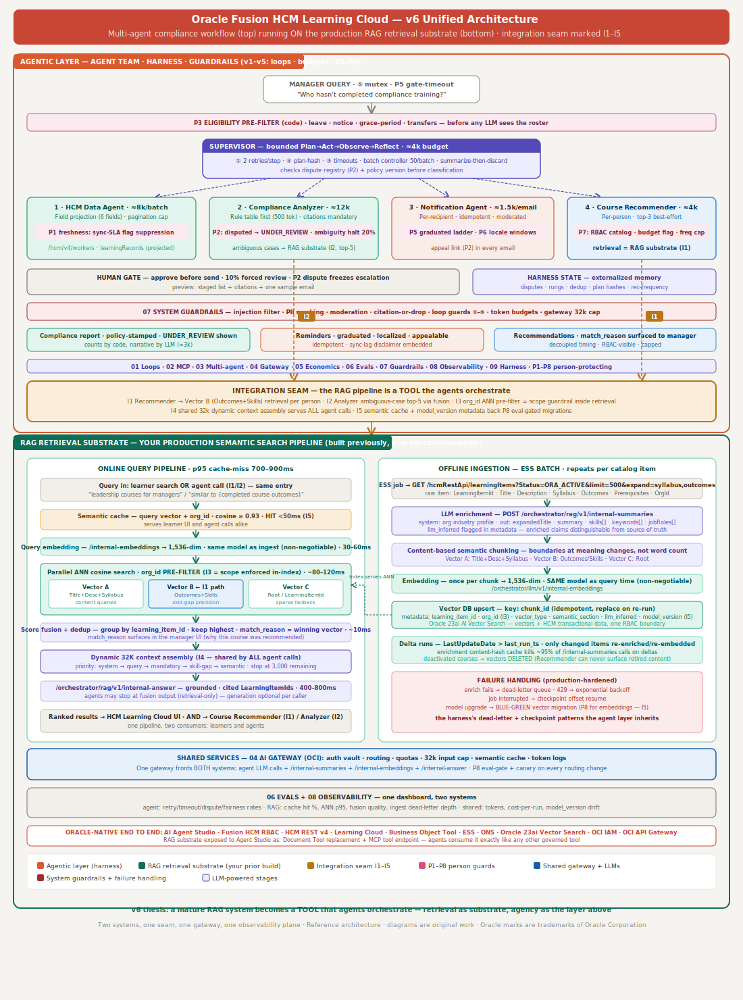

# Oracle Fusion Learning Agentic AI

Enterprise-style React application for a manager-facing Oracle Fusion HCM Learning compliance command center. The app lets a manager sign in, submit compliance queries, review multi-agent findings, inspect policy citations, view course recommendations, and approve staged outreach.

The current version is a deployable demo with realistic seeded data. It is designed as a reference implementation that can later be connected to Oracle Fusion HCM APIs, vector search, notification services, and an agent orchestration backend.

## Architecture Used

This application was built from the unified multi-agent compliance and RAG retrieval architecture below.



The diagram combines two major layers:

- Agentic compliance workflow: manager query, eligibility pre-filter, supervisor agent, HCM data agent, compliance analyzer, notification agent, course recommender, human approval gate, harness state, and guardrails.
- RAG retrieval substrate: semantic cache, query embeddings, parallel ANN vector search, score fusion, deduplication, 32K context assembly, grounded answers, and offline ingestion/enrichment.

The UI maps those concepts into a practical manager console:

- Manager query composer represents the query entry point.
- Query templates simulate common supervisor intents.
- Learner result rows represent outputs from HCM data and compliance analysis agents.
- Policy citations represent citation-or-drop guardrails.
- Risk score, escalation rung, and status badges represent compliance classification.
- Course recommendation cards represent the RAG-backed course recommender path.
- Guardrail list represents active safety, review, and governance controls.
- Approval button represents the human gate before reminders are sent.

## Product Goals

- Provide a clean enterprise UI for compliance managers.
- Demonstrate how agent findings can stay auditable through citations and policy stamps.
- Keep the application runnable locally, in Docker, and in a deployable production build.
- Include realistic test data for demos and future development.
- Preserve a public GitHub-ready codebase with clear setup and run instructions.

## Features

- Manager login page with demo local auth state.
- Manager query input for free-form compliance questions.
- Reusable query templates for missing compliance, high-risk learners, recommendations, and reminders.
- Seeded Oracle Fusion HCM Learning test data.
- Compliance result table with learner, requirement, status, due date, escalation, risk score, reason, and citations.
- Course recommendation cards with vector match explanations.
- Guardrail panel aligned to the multi-agent architecture.
- Responsive enterprise dashboard styling.
- Docker runtime for production-like local execution.
- Render tests that validate the production HTML output.

## Technology Stack

This repository currently implements the application shell and demo workflow:

- React `19`
- Next-compatible `vinext`
- TypeScript for the React UI and thin API proxy
- Python `3.12` for the agentic AI backend
- Tailwind CSS entrypoint with custom CSS
- Cloudflare/Vite-compatible build shape
- Docker and Docker Compose
- Node.js test runner
- Python `unittest`
- ESLint

## Target Oracle AI Stack Mapping

The screenshots that inspired this project show generic AI stack layers. For this Oracle Fusion HCM Learning compliance use case, those generic layers map to Oracle enterprise services as follows.

| Generic stack layer | Generic tools from the AI stack diagram | Oracle Fusion HCM use case mapping |
| --- | --- | --- |
| LLMs | Claude, OpenAI, Gemini, Cohere, Llama, Mistral | Same model families, consumed through Oracle AI Agent Studio multi-LLM support and routed via an OCI-fronted AI Gateway. Example routing: Anthropic Claude for the Supervisor, Cohere Command for the HCM Data Agent, GPT-4o for the Course Recommender, and Llama 3 or Gemini as failover models. |
| Vector database | Pinecone, Weaviate, Milvus, Qdrant, Chroma, pgvector | Oracle Database 23ai AI Vector Search. This is the vector store behind Agent Studio's Document Tool. Policy PDF and learning catalog embeddings live in Oracle's converged database and are indexed by the ESS "Process Agent Documents" job. |
| Text embeddings | OpenAI, Cohere, Nomic, SBERT, Voyage | Cohere Embed through OCI Generative AI. The Oracle Document Tool calls this managed embedding endpoint during ingestion. OCI can support other embedding models, but Cohere is the default enterprise mapping for this design. |
| Data extraction | LlamaParse, Firecrawl, Docling, Crawl4AI | Native Document Tool ingestion for policy PDFs, plus HCM REST APIs and Business Object Tool for governed structured extraction. This design avoids scraping. OCI Document Understanding is the Oracle option for OCR on scanned compliance certificates. |
| Open LLM access | Hugging Face, Groq, Ollama, together.ai | OCI Generative AI service for managed open model access, including Meta Llama on dedicated inference clusters. This replaces local Ollama-style self-hosting for the enterprise deployment path. |
| Framework | LangChain, LlamaIndex, Haystack, txtai | Oracle AI Agent Studio. Agent Teams, Supervisor and Utility agents, Tools, Topics, memory, and orchestration provide the platform-native equivalent of open-source agent frameworks. MCP and A2A provide interoperability. |
| Evaluation | Ragas, Giskard, TruLens | Agent Studio's built-in evaluation framework: golden datasets, LLM-judge scoring, accuracy and faithfulness checks, A/B prompt comparison, and Prompt Playground. These evaluations should be wired into the deployment gate. |

This codebase does not call those Oracle services yet. The current implementation is a runnable React reference UI with seeded data. The table above documents the intended enterprise architecture to connect behind this UI.

## Agentic Runtime Implementation

The project has been rebuilt so the React UI calls a Python server-side agentic runtime instead of doing query logic in the browser or TypeScript.

Runtime entry points:

- `app/api/agentic-query/route.ts`: thin TypeScript proxy route called by the React manager UI.
- `backend/server.py`: Python HTTP service exposing `POST /agentic-query` and `GET /health`.
- `backend/agentic/runtime.py`: supervisor workflow, record filtering, vector retrieval, summary, trace, and evaluation orchestration.
- `backend/agentic/providers.py`: Python provider boundaries for Oracle Coherence, Cohere Embed v3, Oracle Database 23ai Vector Search, Cohere Command R+, Oracle AI Agent Studio, and Agent Studio evaluations.
- `backend/agentic/config.py`: runtime mode and Oracle/OCI environment configuration.
- `docs/oracle-agentic-runtime.md`: detailed runtime design and live-service environment contract.
- `docs/agent-runs/`: timestamped agent execution runbook logs showing prompt, output, human decision, artifact, and validation command for each agent step.
- `docs/REQUIREMENTS_TRACEABILITY_MATRIX.md`: requirement-to-code/test/automation/documentation traceability matrix.

Default mode is `mock`, which keeps the application runnable without OCI credentials. The provider boundaries are named and shaped for the requested Oracle stack:

- Cohere Command R+
- Cohere Embeddings v3
- Oracle Coherence
- Oracle Database 23ai AI Vector Search
- Cohere Embed via OCI Generative AI service
- OCI Generative AI service
- Oracle AI Agent Studio
- Agent Studio built-in evaluation framework

To prepare a live deployment, configure the environment variables described in `docs/oracle-agentic-runtime.md` and replace the placeholder live adapter errors with signed OCI, Oracle Database, Coherence, and Agent Studio client calls.

## Project Structure

```text
.
├── app/
│   ├── api/             # Thin proxy route used by the React UI
│   ├── data.ts          # Seeded manager, learner, recommendation, and guardrail data
│   ├── globals.css      # Responsive enterprise UI styling
│   ├── layout.tsx       # App metadata and root layout
│   └── page.tsx         # Main React manager console
├── backend/
│   ├── agentic/         # Python agentic runtime and Oracle provider boundaries
│   ├── tests/           # Python backend unit tests
│   ├── Dockerfile
│   └── server.py
├── docs/
│   └── oracle-agentic-runtime.md
├── public/
│   └── compliance_multiagent_architecture_v6_unified.svg
├── tests/
│   └── rendered-html.test.mjs
├── Dockerfile
├── docker-compose.yml
├── package.json
├── pnpm-lock.yaml
└── README.md
```

## Prerequisites

Install these before running locally:

- Node.js `>=22.13.0`
- pnpm
- Docker Desktop, if running with Docker

## Run Locally With pnpm

Install dependencies:

```bash
pnpm install
```

Start the development server:

```bash
pnpm run dev
```

In a second terminal, start the Python agentic backend:

```bash
PYTHONPATH=backend python3 backend/server.py
```

Open the app:

```text
http://localhost:3000
```

## Run With Docker

Build and start the production container:

```bash
docker compose up --build
```

Docker starts two services:

- `agentic-backend`: Python agentic AI backend on port `8000`
- `compliance-manager`: React/Vinext UI on port `3000`

Open the app:

```text
http://localhost:3000
```

Stop the container:

```bash
docker compose down
```

Rebuild from scratch if dependencies or the Dockerfile change:

```bash
docker compose build --no-cache
docker compose up
```

## Test And Validate

Build the Python backend:

```bash
pnpm run build:backend
```

Run lint:

```bash
pnpm run lint
```

Build the production output:

```bash
pnpm run build
```

Run tests:

```bash
pnpm test
```

Run unit tests only:

```bash
pnpm run test:unit
```

Run functional tests against a running Docker Compose stack:

```bash
pnpm run test:functional
```

Publish coverage artifacts:

```bash
pnpm run coverage
```

Validate Docker Compose configuration:

```bash
pnpm run validate:compose
```

The test suite builds the app, validates the server-rendered React HTML, and runs Python backend unit tests. It checks that the app includes:

- manager compliance console content
- query input and action controls
- seeded learner records
- policy citations
- course recommendations
- architecture diagram reference
- no leftover starter preview metadata

## Demo Credentials

The login form is intentionally local demo state only.

Default demo values:

```text
Manager email: asha.mehta@example.com
Password: ComplianceDemo2026
```

No real authentication service is called in this version.

## Seeded Test Data

The app uses static test data in `app/data.ts`.

Key exports:

- `managerProfile`: manager identity and sync context.
- `queryTemplates`: reusable manager queries.
- `learnerRecords`: employee learning compliance records.
- `recommendations`: RAG-style course recommendations.
- `guardrails`: active safety and governance controls.

Example learner fields:

- employee ID
- name
- department
- location
- manager
- required course
- due date
- days past due
- compliance status
- escalation rung
- risk score
- explanation
- policy citations
- recommended course

## How The Query Demo Works

The current app simulates agent responses in the browser:

1. The manager selects a query template or edits the query text.
2. The app infers the query intent from the selected template.
3. Seeded learner records are filtered for compliance, risk, recommendations, or communications.
4. A summary is generated from the matching result set.
5. Results are displayed with status, risk, escalation, reasons, and citations.

This keeps the project easy to run without backend credentials while preserving the UI shape needed for a real agentic workflow.

## Future Backend Integration

To connect this reference UI to production systems, replace the local data and filtering with service calls:

- Oracle Fusion HCM workers and learning records APIs.
- Compliance policy service.
- Vector database or Oracle 23ai AI Vector Search.
- Agent supervisor/orchestrator endpoint.
- Notification drafting and approval workflow.
- Audit log and dispute registry persistence.
- Real identity provider or Sign in with ChatGPT/workspace access.

Recommended API boundaries:

- `GET /api/manager/profile`
- `GET /api/query-templates`
- `POST /api/compliance/query`
- `POST /api/outreach/approve`
- `GET /api/recommendations`
- `GET /api/audit/:learnerId`

## Docker Notes

The Docker image uses Node.js `22` and pnpm through Corepack. The production container runs:

```bash
pnpm run start -- --host 0.0.0.0 --port 3000
```

The Compose service maps container port `3000` to host port `3000`.

## GitHub Publish Steps

This repository can be pushed to GitHub with:

```bash
git remote add origin https://github.com/aerugu/Learning_Agentic_AI.git
git branch -M main
git push -u origin main
```

If the remote already exists:

```bash
git remote set-url origin https://github.com/aerugu/Learning_Agentic_AI.git
git push -u origin main
```

## Security And Data Notes

- The included data is demo data, not production Oracle Fusion data.
- Do not commit real employee records, secrets, API tokens, OAuth credentials, or customer-specific policy documents.
- Use environment variables and hosted secret management for production credentials.
- Keep human approval in the workflow before sending notifications.
- Preserve citations and audit logs for compliance decisions.

## Current Status

- Local build passes.
- Render tests pass.
- Docker build and runtime verified.
- Public Sites deployment created.
- Ready to push to `aerugu/Learning_Agentic_AI`.
